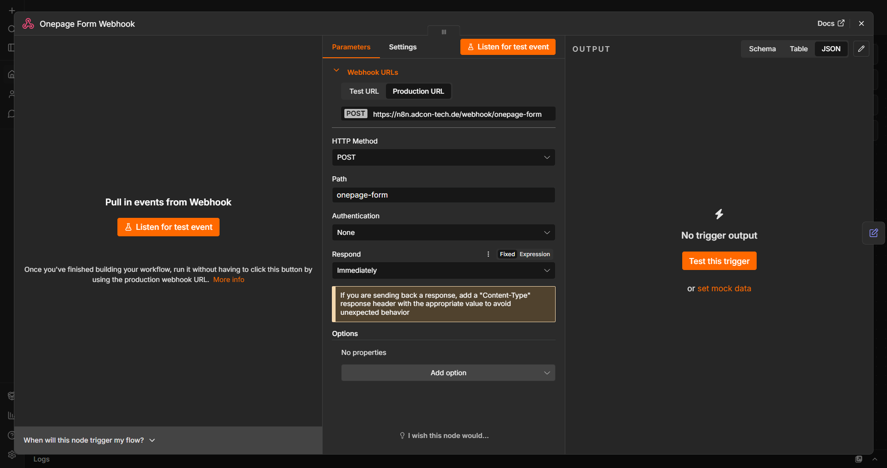
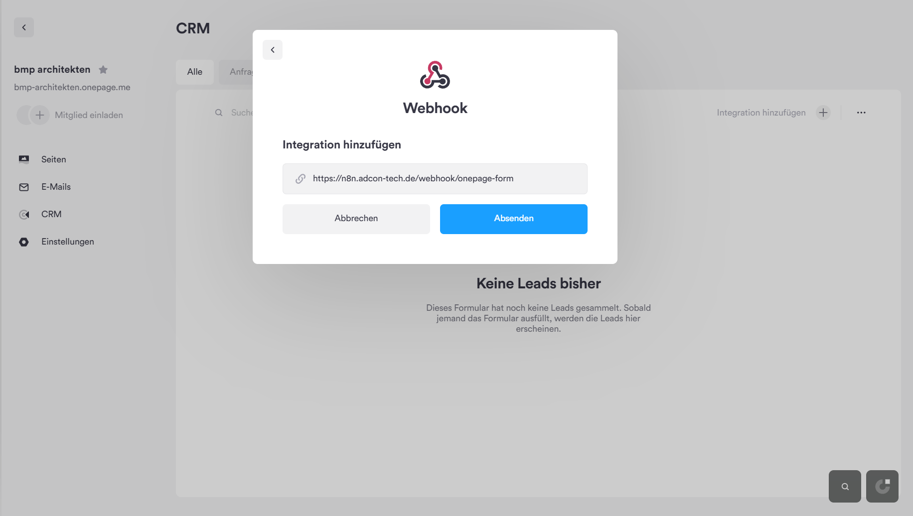

# Setup: Input — Onepage Formular

**Voraussetzung:** Workflow bereits in n8n importiert. Diese Anleitung behandelt ausschließlich die Verbindung zwischen dem Onepage-CRM-Formular und n8n — nicht den Workflow-Aufbau selbst.

## Kurzüberblick

Webhook empfängt eingehende Leads aus einem Onepage-CRM-Formular → normalisiert die Felder → speichert über "Sub: extract_and_store" → stößt bei vorhandener Website-URL zusätzlich "Sub: Webscraper" an.

**Wichtig vorab:** Onepage (die CRM/Formular-Plattform, nicht zu verwechseln mit Fireflies/Granola) unterstützt **native** Webhooks – das funktioniert direkt ohne Umweg.

---

## Schritt 1 – Webhook-URL aus n8n kopieren

Im Node **"Onepage Form Webhook"** die **Production-URL** kopieren (Pfad endet auf `/onepage-form`).

---

## Schritt 2 – Webhook in Onepage CRM eintragen

1. In Onepage einloggen, das betreffende **Projekt** öffnen.
2. Im linken Menü **CRM** auswählen.
3. Oben rechts auf das **Plus-Symbol → "Add Integration"** klicken.
4. In der Liste der Integrationen ganz nach unten scrollen und **"Webhook"** auswählen.
5. Die in Schritt 1 kopierte n8n-URL einfügen und **Submit** klicken.

Ab sofort wird bei jedem neuen Lead/Formular-Eintrag automatisch ein JSON-Paket an die n8n-URL gesendet.

---

## Schritt 3 – Feldnamen im Formular prüfen

Der Node **"Normalize Form"** sucht im eingehenden Payload nach mehreren möglichen Feldnamen (z. B. `project_id` ODER `contact_email`/`email`; `client_name` ODER `company`/`name`; `existing_url` ODER `website`). Das deckt die gängigen Onepage-Formularfelder ab. Trotzdem nach dem ersten Testlauf (Schritt 5) prüfen, ob die echten Werte korrekt durchkommen – sonst ggf. die Feldnamen im Onepage-Formular anpassen oder die Set-Node-Expressions ergänzen.

---

## Schritt 4 – Abhängigkeit zu "Sub: Webscraper"

Wenn im Formular eine Website-URL angegeben wurde, ruft dieser Workflow automatisch "Sub: Webscraper" auf. Dafür müssen dessen Credentials (Anthropic API, Jina AI) bereits eingerichtet sein – siehe eigene Anleitung dazu.

---

## Schritt 5 – Testen

1. Workflow in n8n aktivieren.
2. Ein Testformular auf der Onepage-Website der Agentur/des Kunden ausfüllen und absenden.
3. In n8n unter **Executions** prüfen, ob der Lead ankommt, korrekt normalisiert wird und (falls Website-URL angegeben) der Scraper-Zweig anläuft.
