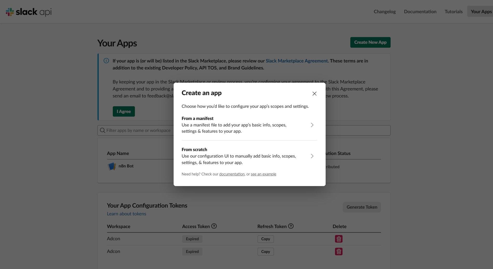
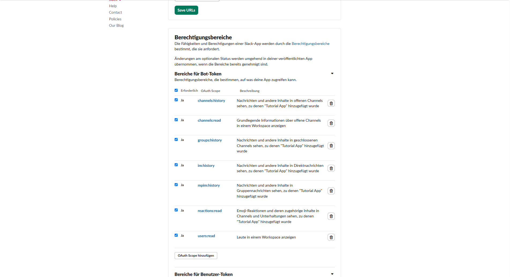
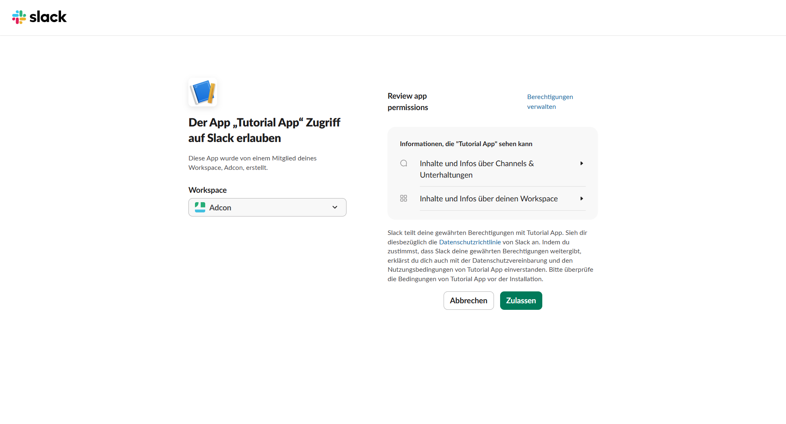
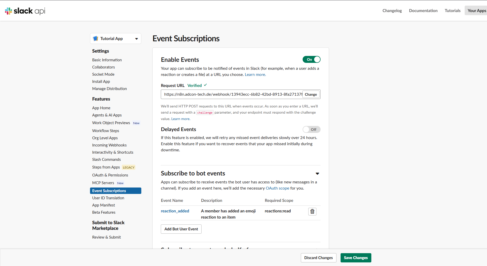
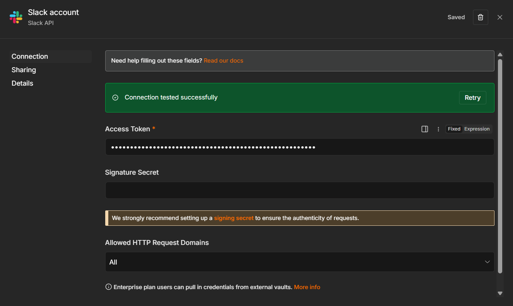

# Setup: Input — Slack

**Voraussetzung:** Workflow bereits in n8n importiert. Diese Anleitung behandelt ausschließlich die Slack-App-Einrichtung und die n8n-Credential — nicht den Workflow-Aufbau selbst.

## Kurzüberblick

Sobald jemand eine Slack-Nachricht mit dem Emoji 📋 (clipboard) markiert, lädt der Workflow den Nachrichtentext per Slack-API und speichert ihn über "Sub: extract_and_store".

---

## Schritt 1 – Slack App erstellen

1. [api.slack.com/apps](https://api.slack.com/apps) öffnen, einloggen.
2. **"Create New App" → "From scratch"**.
3. Namen vergeben (z. B. "Agentur Briefing Bot") und das Workspace der Agentur auswählen.

---

## Schritt 2 – Bot Token Scopes setzen

1. Im Menü links **"OAuth & Permissions"** öffnen.
2. Unter **"Scopes" → "Bot Token Scopes"** folgende Scopes hinzufügen:
   - `reactions:read` (damit die App Emoji-Reaktionen sieht)
   - `channels:history`, `groups:history`, `im:history`, `mpim:history` (damit der Node "Fetch Slack Message" den Nachrichtentext laden kann)
   - `channels:read`, `users:read` (empfohlen für ID-Auflösung)

---

## Schritt 3 – App im Workspace installieren

1. Oben auf der Seite **"OAuth & Permissions"** auf **"Install to Workspace"** klicken (Workspace-Admin-Rechte nötig) und Berechtigungen bestätigen.
2. Den angezeigten **"Bot User OAuth Token"** (beginnt mit `xoxb-`) kopieren.

---

## Schritt 4 – Event Subscriptions einrichten

1. Im Node **"Slack Reaction Trigger"** in n8n die **Webhook-URL** kopieren (Test- oder Production-URL je nach Status).
2. In der Slack App links **"Event Subscriptions"** öffnen, **"Enable Events"** aktivieren.
3. Die kopierte n8n-URL als **"Request URL"** eintragen – Slack verifiziert die URL automatisch (n8n muss dafür laufen/erreichbar sein).
4. Unter **"Subscribe to bot events"** das Event **"reaction_added"** hinzufügen, speichern.

---

## Schritt 5 – Bot in relevante Kanäle einladen

Die App sieht nur Reaktionen/Nachrichten in Kanälen, in denen sie Mitglied ist. In jedem relevanten Slack-Kanal `/invite @AppName` ausführen.

---

## Schritt 6 – Credential in n8n anlegen

1. **Credentials → New Credential → "Slack API"**.
2. Den in Schritt 3 kopierten Bot User OAuth Token als Access Token einfügen, speichern.
3. Diese Credential in **beiden** Nodes hinterlegen: "Slack Reaction Trigger" und "Fetch Slack Message".

---

## Schritt 7 – Testen

1. Workflow in n8n aktivieren.
2. In einem Kanal, in dem der Bot Mitglied ist, eine Testnachricht mit 📋 reagieren.
3. In n8n unter **Executions** prüfen, ob die Nachricht abgeholt und an "Sub: extract_and_store" übergeben wurde.
